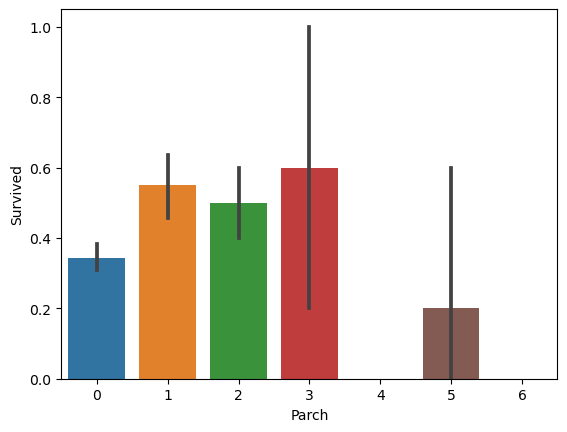

<!--Header-->
<div id="header" class="fluid-row" style="max-width: 910px; margin-left: auto; margin-right: auto">
<div class="row" style="color: #4D4D4D;font-size: 15px;padding-bottom: 20px">
<div class="col-md-7">

</div>
<div class="col-md-5">
<h1 style="margin:15px 0px 0px;font-size: 40px;">派遣会社(Agency)</h1>
<div style="text-align:left;margin-top: 5px;"></div>
</div>
</div>
<div class="row" style="background: #73EDFF;padding: 5px 15px;">
<div class="col-md-6">
<div style="text-align:center;"> </div>
</div>
</div>
</div>
<!--/Header-->

## Introduction ##

In this project, we will work on a comprehensive classification example using the dataset from the [Titanic: Machine Learning from Disaster](https://www.kaggle.com/c/titanic) competition hosted on [Kaggle](https://www.kaggle.com/).

The Titanic competition aims to predict the survival outcome of passengers aboard the Titanic ship based on various features such as age, gender, ticket class, and more. By analyzing this dataset and building a classification model, we can gain insights into the factors that influenced survival rates during the tragic event.

To accomplish this, we will utilize a combination of data analysis, feature engineering, and machine learning techniques. Our goal is to develop a robust classification model that can accurately predict whether a passenger survived or not.


Through this project, we will delve into the entire data science pipeline, starting from data exploration and preprocessing to model selection, training, and evaluation. We will also employ various techniques to handle missing values, handle categorical variables, and optimize our model's performance.

## Loading the libraries we need and libraries we require:
- %matplotlib inline: This is a magic command in Jupyter Notebook that allows the generated plots to be displayed inline within the notebook itself.

- numpy (np): This library provides support for efficient numerical operations and array manipulation in Python.

- pandas (pd): Pandas is a powerful data manipulation library that provides data structures and functions for working with structured data, such as CSV files or database tables. It offers flexible data handling capabilities and enables easy data manipulation and analysis.

- re: This library is the regular expression module in Python. It provides functions and methods for working with regular expressions, allowing pattern matching and text manipulation.

- scipy.stats (from scipy.stats import norm): This module from the SciPy library provides a wide range of statistical functions and distributions. The norm function specifically deals with the normal (Gaussian) distribution.

- seaborn: Seaborn is a data visualization library based on Matplotlib. It provides a high-level interface for creating informative and attractive statistical graphics.

- matplotlib.pyplot (plt): Matplotlib is a widely used plotting library in Python. The pyplot module provides a collection of functions that enable the creation of various types of plots, such as line plots, bar charts, histograms, and scatter plots.

By utilizing these libraries in our project, we can perform data manipulation, statistical analysis, and create visually appealing plots to communicate your findings effectively.


```python
%matplotlib inline

import numpy as np
import pandas as pd
import re as re
from scipy.stats import norm
!pip install seaborn
import seaborn as sns
import matplotlib.pyplot as plt
```

    Collecting seaborn
      Downloading seaborn-0.12.2-py3-none-any.whl (293 kB)
                                                  0.0/293.3 kB ? eta -:--:--
         ---------------------------------      256.0/293.3 kB 7.7 MB/s eta 0:00:01
         -------------------------------------- 293.3/293.3 kB 4.5 MB/s eta 0:00:00
    Requirement already satisfied: numpy!=1.24.0,>=1.17 in c:\users\panasonic\anaconda3\lib\site-packages (from seaborn) (1.25.0)
    Requirement already satisfied: pandas>=0.25 in c:\users\panasonic\anaconda3\lib\site-packages (from seaborn) (1.5.3)
    Requirement already satisfied: matplotlib!=3.6.1,>=3.1 in c:\users\panasonic\anaconda3\lib\site-packages (from seaborn) (3.7.1)
    Requirement already satisfied: contourpy>=1.0.1 in c:\users\panasonic\anaconda3\lib\site-packages (from matplotlib!=3.6.1,>=3.1->seaborn) (1.0.5)
    Requirement already satisfied: cycler>=0.10 in c:\users\panasonic\anaconda3\lib\site-packages (from matplotlib!=3.6.1,>=3.1->seaborn) (0.11.0)
    Requirement already satisfied: fonttools>=4.22.0 in c:\users\panasonic\anaconda3\lib\site-packages (from matplotlib!=3.6.1,>=3.1->seaborn) (4.25.0)
    Requirement already satisfied: kiwisolver>=1.0.1 in c:\users\panasonic\anaconda3\lib\site-packages (from matplotlib!=3.6.1,>=3.1->seaborn) (1.4.4)
    Requirement already satisfied: packaging>=20.0 in c:\users\panasonic\anaconda3\lib\site-packages (from matplotlib!=3.6.1,>=3.1->seaborn) (23.0)
    Requirement already satisfied: pillow>=6.2.0 in c:\users\panasonic\anaconda3\lib\site-packages (from matplotlib!=3.6.1,>=3.1->seaborn) (9.4.0)
    Requirement already satisfied: pyparsing>=2.3.1 in c:\users\panasonic\anaconda3\lib\site-packages (from matplotlib!=3.6.1,>=3.1->seaborn) (3.0.9)
    Requirement already satisfied: python-dateutil>=2.7 in c:\users\panasonic\anaconda3\lib\site-packages (from matplotlib!=3.6.1,>=3.1->seaborn) (2.8.2)
    Requirement already satisfied: importlib-resources>=3.2.0 in c:\users\panasonic\anaconda3\lib\site-packages (from matplotlib!=3.6.1,>=3.1->seaborn) (5.2.0)
    Requirement already satisfied: pytz>=2020.1 in c:\users\panasonic\anaconda3\lib\site-packages (from pandas>=0.25->seaborn) (2022.7)
    Requirement already satisfied: zipp>=3.1.0 in c:\users\panasonic\anaconda3\lib\site-packages (from importlib-resources>=3.2.0->matplotlib!=3.6.1,>=3.1->seaborn) (3.11.0)
    Requirement already satisfied: six>=1.5 in c:\users\panasonic\anaconda3\lib\site-packages (from python-dateutil>=2.7->matplotlib!=3.6.1,>=3.1->seaborn) (1.16.0)
    Installing collected packages: seaborn
    Successfully installed seaborn-0.12.2
    

## Loading the dataset


```python
df = pd.read_csv('titanic/titanic.csv', header = 0)
```

## Data Description
Our dataset consists of 12 columns or variables, out of which 3 (`Age`, `Cabin`, and `Embarked`) have missing values. The variable we want to predict is `Survived`, which indicates whether the passenger survived the tragedy of the Titanic.


```python
df.info()
```

    <class 'pandas.core.frame.DataFrame'>
    RangeIndex: 891 entries, 0 to 890
    Data columns (total 12 columns):
     #   Column       Non-Null Count  Dtype  
    ---  ------       --------------  -----  
     0   PassengerId  891 non-null    int64  
     1   Survived     891 non-null    int64  
     2   Pclass       891 non-null    int64  
     3   Name         891 non-null    object 
     4   Sex          891 non-null    object 
     5   Age          714 non-null    float64
     6   SibSp        891 non-null    int64  
     7   Parch        891 non-null    int64  
     8   Ticket       891 non-null    object 
     9   Fare         891 non-null    float64
     10  Cabin        204 non-null    object 
     11  Embarked     889 non-null    object 
    dtypes: float64(2), int64(5), object(5)
    memory usage: 83.7+ KB
    


```python
df.head()
```


<div>
<style scoped>
    .dataframe tbody tr th:only-of-type {
        vertical-align: middle;
    }

    .dataframe tbody tr th {
        vertical-align: top;
    }

    .dataframe thead th {
        text-align: right;
    }
</style>
<table border="1" class="dataframe">
  <thead>
    <tr style="text-align: right;">
      <th></th>
      <th>PassengerId</th>
      <th>Survived</th>
      <th>Pclass</th>
      <th>Name</th>
      <th>Sex</th>
      <th>Age</th>
      <th>SibSp</th>
      <th>Parch</th>
      <th>Ticket</th>
      <th>Fare</th>
      <th>Cabin</th>
      <th>Embarked</th>
    </tr>
  </thead>
  <tbody>
    <tr>
      <th>0</th>
      <td>1</td>
      <td>0</td>
      <td>3</td>
      <td>Braund, Mr. Owen Harris</td>
      <td>male</td>
      <td>22.0</td>
      <td>1</td>
      <td>0</td>
      <td>A/5 21171</td>
      <td>7.2500</td>
      <td>NaN</td>
      <td>S</td>
    </tr>
    <tr>
      <th>1</th>
      <td>2</td>
      <td>1</td>
      <td>1</td>
      <td>Cumings, Mrs. John Bradley (Florence Briggs Th...</td>
      <td>female</td>
      <td>38.0</td>
      <td>1</td>
      <td>0</td>
      <td>PC 17599</td>
      <td>71.2833</td>
      <td>C85</td>
      <td>C</td>
    </tr>
    <tr>
      <th>2</th>
      <td>3</td>
      <td>1</td>
      <td>3</td>
      <td>Heikkinen, Miss. Laina</td>
      <td>female</td>
      <td>26.0</td>
      <td>0</td>
      <td>0</td>
      <td>STON/O2. 3101282</td>
      <td>7.9250</td>
      <td>NaN</td>
      <td>S</td>
    </tr>
    <tr>
      <th>3</th>
      <td>4</td>
      <td>1</td>
      <td>1</td>
      <td>Futrelle, Mrs. Jacques Heath (Lily May Peel)</td>
      <td>female</td>
      <td>35.0</td>
      <td>1</td>
      <td>0</td>
      <td>113803</td>
      <td>53.1000</td>
      <td>C123</td>
      <td>S</td>
    </tr>
    <tr>
      <th>4</th>
      <td>5</td>
      <td>0</td>
      <td>3</td>
      <td>Allen, Mr. William Henry</td>
      <td>male</td>
      <td>35.0</td>
      <td>0</td>
      <td>0</td>
      <td>373450</td>
      <td>8.0500</td>
      <td>NaN</td>
      <td>S</td>
    </tr>
  </tbody>
</table>
</div>


```python
df.describe()
```


<div>
<style scoped>
    .dataframe tbody tr th:only-of-type {
        vertical-align: middle;
    }

    .dataframe tbody tr th {
        vertical-align: top;
    }

    .dataframe thead th {
        text-align: right;
    }
</style>
<table border="1" class="dataframe">
  <thead>
    <tr style="text-align: right;">
      <th></th>
      <th>PassengerId</th>
      <th>Survived</th>
      <th>Pclass</th>
      <th>Age</th>
      <th>SibSp</th>
      <th>Parch</th>
      <th>Fare</th>
    </tr>
  </thead>
  <tbody>
    <tr>
      <th>count</th>
      <td>891.000000</td>
      <td>891.000000</td>
      <td>891.000000</td>
      <td>714.000000</td>
      <td>891.000000</td>
      <td>891.000000</td>
      <td>891.000000</td>
    </tr>
    <tr>
      <th>mean</th>
      <td>446.000000</td>
      <td>0.383838</td>
      <td>2.308642</td>
      <td>29.699118</td>
      <td>0.523008</td>
      <td>0.381594</td>
      <td>32.204208</td>
    </tr>
    <tr>
      <th>std</th>
      <td>257.353842</td>
      <td>0.486592</td>
      <td>0.836071</td>
      <td>14.526497</td>
      <td>1.102743</td>
      <td>0.806057</td>
      <td>49.693429</td>
    </tr>
    <tr>
      <th>min</th>
      <td>1.000000</td>
      <td>0.000000</td>
      <td>1.000000</td>
      <td>0.420000</td>
      <td>0.000000</td>
      <td>0.000000</td>
      <td>0.000000</td>
    </tr>
    <tr>
      <th>25%</th>
      <td>223.500000</td>
      <td>0.000000</td>
      <td>2.000000</td>
      <td>20.125000</td>
      <td>0.000000</td>
      <td>0.000000</td>
      <td>7.910400</td>
    </tr>
    <tr>
      <th>50%</th>
      <td>446.000000</td>
      <td>0.000000</td>
      <td>3.000000</td>
      <td>28.000000</td>
      <td>0.000000</td>
      <td>0.000000</td>
      <td>14.454200</td>
    </tr>
    <tr>
      <th>75%</th>
      <td>668.500000</td>
      <td>1.000000</td>
      <td>3.000000</td>
      <td>38.000000</td>
      <td>1.000000</td>
      <td>0.000000</td>
      <td>31.000000</td>
    </tr>
    <tr>
      <th>max</th>
      <td>891.000000</td>
      <td>1.000000</td>
      <td>3.000000</td>
      <td>80.000000</td>
      <td>8.000000</td>
      <td>6.000000</td>
      <td>512.329200</td>
    </tr>
  </tbody>
</table>
</div>


## Data transformation
We will analyse variable by variable in order to elucidate what transformations it will need in order to be used for modelling the data.

### `PassengerId`
Passenger identifier. This is a numerical correlative variable, which has no predictive value. We will not include it in our model.


```python
df['PassengerId'].head(10)
```


    0     1
    1     2
    2     3
    3     4
    4     5
    5     6
    6     7
    7     8
    8     9
    9    10
    Name: PassengerId, dtype: int64


```python
df.drop(['PassengerId'], axis=1, inplace=True)
```

`Survived`
Indicates whether the passenger survived (`1`) or not (`0`). This will be our predictor variable. We see that there are about 38% of passengers who survived.


```python
sns.barplot(x="Survived", data=df)
```


    <Axes: xlabel='Survived'>


    

    


```python
df.describe()['Survived']
```


    count    891.000000
    mean       0.383838
    std        0.486592
    min        0.000000
    25%        0.000000
    50%        0.000000
    75%        1.000000
    max        1.000000
    Name: Survived, dtype: float64


`Pclass`
Class of the boarding ticket. It is a categorical variable, with three different values corresponding to first, second and third class. We see that it is correlated with survival: the higher the class, the more survivors there are.


```python
df[['Pclass', 'Survived']].groupby(['Pclass'],as_index=True).mean()
```


<div>
<style scoped>
    .dataframe tbody tr th:only-of-type {
        vertical-align: middle;
    }

    .dataframe tbody tr th {
        vertical-align: top;
    }

    .dataframe thead th {
        text-align: right;
    }
</style>
<table border="1" class="dataframe">
  <thead>
    <tr style="text-align: right;">
      <th></th>
      <th>Survived</th>
    </tr>
    <tr>
      <th>Pclass</th>
      <th></th>
    </tr>
  </thead>
  <tbody>
    <tr>
      <th>1</th>
      <td>0.629630</td>
    </tr>
    <tr>
      <th>2</th>
      <td>0.472826</td>
    </tr>
    <tr>
      <th>3</th>
      <td>0.242363</td>
    </tr>
  </tbody>
</table>
</div>


```python
sns.barplot(x="Pclass", y="Survived", data=df)
```


    <Axes: xlabel='Pclass', ylabel='Survived'>


    

    


### `Sex`
Sex of the passenger. This is a categorical variable with two values, `male` and `female`. We will convert it to binary for our analysis.


```python
df[["Sex", "Survived"]].groupby(['Sex'], as_index=False).mean()
```


<div>
<style scoped>
    .dataframe tbody tr th:only-of-type {
        vertical-align: middle;
    }

    .dataframe tbody tr th {
        vertical-align: top;
    }

    .dataframe thead th {
        text-align: right;
    }
</style>
<table border="1" class="dataframe">
  <thead>
    <tr style="text-align: right;">
      <th></th>
      <th>Sex</th>
      <th>Survived</th>
    </tr>
  </thead>
  <tbody>
    <tr>
      <th>0</th>
      <td>female</td>
      <td>0.742038</td>
    </tr>
    <tr>
      <th>1</th>
      <td>male</td>
      <td>0.188908</td>
    </tr>
  </tbody>
</table>
</div>


```python
sns.barplot(x="Sex", y="Survived", data=df)
```


    <Axes: xlabel='Sex', ylabel='Survived'>


    

    


```python
converting the categorical 'Sex' column into a boolean representation for the purpose of further analysis or modeling, 
where the sex of a passenger will be represented as True (if male) or False (if female).
```


```python
df['Sex'] = df['Sex'] == 'male'
```


```python
print(df)
```

         Survived  Pclass                                               Name  \
    0           0       3                            Braund, Mr. Owen Harris   
    1           1       1  Cumings, Mrs. John Bradley (Florence Briggs Th...   
    2           1       3                             Heikkinen, Miss. Laina   
    3           1       1       Futrelle, Mrs. Jacques Heath (Lily May Peel)   
    4           0       3                           Allen, Mr. William Henry   
    ..        ...     ...                                                ...   
    886         0       2                              Montvila, Rev. Juozas   
    887         1       1                       Graham, Miss. Margaret Edith   
    888         0       3           Johnston, Miss. Catherine Helen "Carrie"   
    889         1       1                              Behr, Mr. Karl Howell   
    890         0       3                                Dooley, Mr. Patrick   
    
           Sex   Age  SibSp  Parch            Ticket     Fare Cabin Embarked  
    0     True  22.0      1      0         A/5 21171   7.2500   NaN        S  
    1    False  38.0      1      0          PC 17599  71.2833   C85        C  
    2    False  26.0      0      0  STON/O2. 3101282   7.9250   NaN        S  
    3    False  35.0      1      0            113803  53.1000  C123        S  
    4     True  35.0      0      0            373450   8.0500   NaN        S  
    ..     ...   ...    ...    ...               ...      ...   ...      ...  
    886   True  27.0      0      0            211536  13.0000   NaN        S  
    887  False  19.0      0      0            112053  30.0000   B42        S  
    888  False   NaN      1      2        W./C. 6607  23.4500   NaN        S  
    889   True  26.0      0      0            111369  30.0000  C148        C  
    890   True  32.0      0      0            370376   7.7500   NaN        Q  
    
    [891 rows x 11 columns]
    

### `SibSp`
Number of siblings or spouses of the passenger on the Titanic. This is a numerical variable.


```python
df[["SibSp", "Survived"]].groupby(['SibSp'], as_index=False).mean()
```


<div>
<style scoped>
    .dataframe tbody tr th:only-of-type {
        vertical-align: middle;
    }

    .dataframe tbody tr th {
        vertical-align: top;
    }

    .dataframe thead th {
        text-align: right;
    }
</style>
<table border="1" class="dataframe">
  <thead>
    <tr style="text-align: right;">
      <th></th>
      <th>SibSp</th>
      <th>Survived</th>
    </tr>
  </thead>
  <tbody>
    <tr>
      <th>0</th>
      <td>0</td>
      <td>0.345395</td>
    </tr>
    <tr>
      <th>1</th>
      <td>1</td>
      <td>0.535885</td>
    </tr>
    <tr>
      <th>2</th>
      <td>2</td>
      <td>0.464286</td>
    </tr>
    <tr>
      <th>3</th>
      <td>3</td>
      <td>0.250000</td>
    </tr>
    <tr>
      <th>4</th>
      <td>4</td>
      <td>0.166667</td>
    </tr>
    <tr>
      <th>5</th>
      <td>5</td>
      <td>0.000000</td>
    </tr>
    <tr>
      <th>6</th>
      <td>8</td>
      <td>0.000000</td>
    </tr>
  </tbody>
</table>
</div>


```python
sns.barplot(x="SibSp", y="Survived", data=df)
```


    <Axes: xlabel='SibSp', ylabel='Survived'>


    

    


### `Parch`
Parents and children of the passenger inside the Titanic. It is a numerical variable.


```python
df[["Parch", "Survived"]].groupby(['Parch'], as_index=False).mean()
```


<div>
<style scoped>
    .dataframe tbody tr th:only-of-type {
        vertical-align: middle;
    }

    .dataframe tbody tr th {
        vertical-align: top;
    }

    .dataframe thead th {
        text-align: right;
    }
</style>
<table border="1" class="dataframe">
  <thead>
    <tr style="text-align: right;">
      <th></th>
      <th>Parch</th>
      <th>Survived</th>
    </tr>
  </thead>
  <tbody>
    <tr>
      <th>0</th>
      <td>0</td>
      <td>0.343658</td>
    </tr>
    <tr>
      <th>1</th>
      <td>1</td>
      <td>0.550847</td>
    </tr>
    <tr>
      <th>2</th>
      <td>2</td>
      <td>0.500000</td>
    </tr>
    <tr>
      <th>3</th>
      <td>3</td>
      <td>0.600000</td>
    </tr>
    <tr>
      <th>4</th>
      <td>4</td>
      <td>0.000000</td>
    </tr>
    <tr>
      <th>5</th>
      <td>5</td>
      <td>0.200000</td>
    </tr>
    <tr>
      <th>6</th>
      <td>6</td>
      <td>0.000000</td>
    </tr>
  </tbody>
</table>
</div>


```python
sns.barplot(x="Parch", y="Survived", data=df)
```


    <Axes: xlabel='Parch', ylabel='Survived'>


    

    


### `FamilySize`
With the variables `SibSp` and `Parch` we can calculate the size of a passenger's family + 1 member, which we will call `FamilySize`. It will therefore be a numeric variable.


```python
df['FamilySize'] = df['SibSp'] + df['Parch'] + 1
df[["FamilySize", "Survived"]].groupby(['FamilySize'], as_index=False).mean()
```


<div>
<style scoped>
    .dataframe tbody tr th:only-of-type {
        vertical-align: middle;
    }

    .dataframe tbody tr th {
        vertical-align: top;
    }

    .dataframe thead th {
        text-align: right;
    }
</style>
<table border="1" class="dataframe">
  <thead>
    <tr style="text-align: right;">
      <th></th>
      <th>FamilySize</th>
      <th>Survived</th>
    </tr>
  </thead>
  <tbody>
    <tr>
      <th>0</th>
      <td>1</td>
      <td>0.303538</td>
    </tr>
    <tr>
      <th>1</th>
      <td>2</td>
      <td>0.552795</td>
    </tr>
    <tr>
      <th>2</th>
      <td>3</td>
      <td>0.578431</td>
    </tr>
    <tr>
      <th>3</th>
      <td>4</td>
      <td>0.724138</td>
    </tr>
    <tr>
      <th>4</th>
      <td>5</td>
      <td>0.200000</td>
    </tr>
    <tr>
      <th>5</th>
      <td>6</td>
      <td>0.136364</td>
    </tr>
    <tr>
      <th>6</th>
      <td>7</td>
      <td>0.333333</td>
    </tr>
    <tr>
      <th>7</th>
      <td>8</td>
      <td>0.000000</td>
    </tr>
    <tr>
      <th>8</th>
      <td>11</td>
      <td>0.000000</td>
    </tr>
  </tbody>
</table>
</div>


```python
sns.barplot(x="FamilySize", y="Survived", data=df)
```


    <Axes: xlabel='FamilySize', ylabel='Survived'>


    

    


### `IsAlone`
It is interesting to characterise whether the passenger has no family inside the Titanic. Assuming that the one-member families on the titanic are in fact one person alone. We will calculate the binary variable `IsAlone`.


```python
df['IsAlone'] = 0
df.loc[df['FamilySize'] == 1, 'IsAlone'] = 1
df[['IsAlone', 'Survived']].groupby(['IsAlone'], as_index=False).mean()
```


<div>
<style scoped>
    .dataframe tbody tr th:only-of-type {
        vertical-align: middle;
    }

    .dataframe tbody tr th {
        vertical-align: top;
    }

    .dataframe thead th {
        text-align: right;
    }
</style>
<table border="1" class="dataframe">
  <thead>
    <tr style="text-align: right;">
      <th></th>
      <th>IsAlone</th>
      <th>Survived</th>
    </tr>
  </thead>
  <tbody>
    <tr>
      <th>0</th>
      <td>0</td>
      <td>0.505650</td>
    </tr>
    <tr>
      <th>1</th>
      <td>1</td>
      <td>0.303538</td>
    </tr>
  </tbody>
</table>
</div>


```python
print(df)
```

         Survived  Pclass                                               Name  \
    0           0       3                            Braund, Mr. Owen Harris   
    1           1       1  Cumings, Mrs. John Bradley (Florence Briggs Th...   
    2           1       3                             Heikkinen, Miss. Laina   
    3           1       1       Futrelle, Mrs. Jacques Heath (Lily May Peel)   
    4           0       3                           Allen, Mr. William Henry   
    ..        ...     ...                                                ...   
    886         0       2                              Montvila, Rev. Juozas   
    887         1       1                       Graham, Miss. Margaret Edith   
    888         0       3           Johnston, Miss. Catherine Helen "Carrie"   
    889         1       1                              Behr, Mr. Karl Howell   
    890         0       3                                Dooley, Mr. Patrick   
    
           Sex   Age  SibSp  Parch            Ticket     Fare Cabin Embarked  \
    0     True  22.0      1      0         A/5 21171   7.2500   NaN        S   
    1    False  38.0      1      0          PC 17599  71.2833   C85        C   
    2    False  26.0      0      0  STON/O2. 3101282   7.9250   NaN        S   
    3    False  35.0      1      0            113803  53.1000  C123        S   
    4     True  35.0      0      0            373450   8.0500   NaN        S   
    ..     ...   ...    ...    ...               ...      ...   ...      ...   
    886   True  27.0      0      0            211536  13.0000   NaN        S   
    887  False  19.0      0      0            112053  30.0000   B42        S   
    888  False   NaN      1      2        W./C. 6607  23.4500   NaN        S   
    889   True  26.0      0      0            111369  30.0000  C148        C   
    890   True  32.0      0      0            370376   7.7500   NaN        Q   
    
         FamilySize  IsAlone  
    0             2        0  
    1             2        0  
    2             1        1  
    3             2        0  
    4             1        1  
    ..          ...      ...  
    886           1        1  
    887           1        1  
    888           4        0  
    889           1        1  
    890           1        1  
    
    [891 rows x 13 columns]
    


```python
sns.barplot(x="IsAlone", y="Survived", data=df)
```


    <Axes: xlabel='IsAlone', ylabel='Survived'>


    

    


### `Ticket`
Passenger ticket number. It is alphanumeric and a priori does not offer information that could help us in the predictive model. We will not include it.


```python
df.drop(['Ticket'], axis=1, inplace=True)
```

### `Embarked`
Indicates the passenger's port of embarkation. It is a categorical variable where `C` indicates embarkation at Cherbourg, `Q` at Queenstown and `S` at Southampton. We will complete the infinite values by imputing the port of departure as Southampton.


```python
df['Embarked'] = df['Embarked'].fillna('S')
df[['Embarked', 'Survived']].groupby(['Embarked'], as_index=False).mean()
```


<div>
<style scoped>
    .dataframe tbody tr th:only-of-type {
        vertical-align: middle;
    }

    .dataframe tbody tr th {
        vertical-align: top;
    }

    .dataframe thead th {
        text-align: right;
    }
</style>
<table border="1" class="dataframe">
  <thead>
    <tr style="text-align: right;">
      <th></th>
      <th>Embarked</th>
      <th>Survived</th>
    </tr>
  </thead>
  <tbody>
    <tr>
      <th>0</th>
      <td>C</td>
      <td>0.553571</td>
    </tr>
    <tr>
      <th>1</th>
      <td>Q</td>
      <td>0.389610</td>
    </tr>
    <tr>
      <th>2</th>
      <td>S</td>
      <td>0.339009</td>
    </tr>
  </tbody>
</table>
</div>


```python
sns.barplot(x="Embarked", y="Survived", data=df)
```


    <Axes: xlabel='Embarked', ylabel='Survived'>


    

    


### `Fare`
It indicates the price of the ticket. It is therefore a continuous numerical variable.


```python
from scipy.stats import norm

# Ploting the distribution of 'Fare'
sns.displot(df['Fare'], kde=True)

# Fiting a normal distribution to the data
mu, std = norm.fit(df['Fare'])
xmin, xmax = plt.xlim()
x = np.linspace(xmin, xmax, 100)
p = norm.pdf(x, mu, std)
plt.plot(x, p, 'r', linewidth=2)

# Show the plot
plt.show()
```


    

    


We transform the variable into a categorical variable.In other words, we are going to discretise them


```python
df['FareGroup'] = pd.qcut(df['Fare'], 7, labels=['A', 'B', 'C', 'D', 'E', 'F', 'G'])
df[['FareGroup', 'Survived']].groupby(['FareGroup'], as_index=False).mean()
```


<div>
<style scoped>
    .dataframe tbody tr th:only-of-type {
        vertical-align: middle;
    }

    .dataframe tbody tr th {
        vertical-align: top;
    }

    .dataframe thead th {
        text-align: right;
    }
</style>
<table border="1" class="dataframe">
  <thead>
    <tr style="text-align: right;">
      <th></th>
      <th>FareGroup</th>
      <th>Survived</th>
    </tr>
  </thead>
  <tbody>
    <tr>
      <th>0</th>
      <td>A</td>
      <td>0.207143</td>
    </tr>
    <tr>
      <th>1</th>
      <td>B</td>
      <td>0.200000</td>
    </tr>
    <tr>
      <th>2</th>
      <td>C</td>
      <td>0.316327</td>
    </tr>
    <tr>
      <th>3</th>
      <td>D</td>
      <td>0.406250</td>
    </tr>
    <tr>
      <th>4</th>
      <td>E</td>
      <td>0.445312</td>
    </tr>
    <tr>
      <th>5</th>
      <td>F</td>
      <td>0.456000</td>
    </tr>
    <tr>
      <th>6</th>
      <td>G</td>
      <td>0.685039</td>
    </tr>
  </tbody>
</table>
</div>


```python
sns.barplot(x="FareGroup", y="Survived", data=df)
```


    <Axes: xlabel='FareGroup', ylabel='Survived'>


    

    


We eliminate the variable we do not need


```python
df.drop(['Fare'], axis=1, inplace=True)
```

## `Cabin`
Passenger cabin number. This is a text variable, indicating which cabin the passenger was in. We will transform the variable into a binary variable depending on whether the passenger was in a cabin or not. 


```python
df['InCabin'] = ~df['Cabin'].isnull()
```


```python
sns.barplot(x="InCabin", y="Survived", data=df)
plt.show()
```


    

    


```python
df.drop(['Cabin'], axis=1, inplace=True)
```

### `Age`
Edad del pasajero. Es una variable numerica que tiene bastantes valores vacios. Categorizaremos la variable en 8 categorías según la edad que tenga. La categoría `Unknown` será la de aquellos pasajeros que no tengamos la edad.


```python
df["Age"] = df["Age"].fillna(-0.5)
bins = [-1, 0, 5, 12, 18, 24, 35, 60, np.inf]
labels = ['Unknown', 'Baby', 'Child', 'Teenager', 'Student', 'Young Adult', 'Adult', 'Senior']
df['AgeGroup'] = pd.cut(df["Age"], bins, labels = labels)
```


```python
sns.barplot(x="AgeGroup", y="Survived", data=df)
plt.show()
```


    

    


```python
df.drop(['Age'], axis=1, inplace=True)
```

### `Name`.

Name of the passenger. From this variable we can extract the titles included with the name, such as `Mr`, `Miss` or `Master`, which can have a predictive value. The rest of the name, we will ignore.


```python
df['Name'].head(10)
```


    0                              Braund, Mr. Owen Harris
    1    Cumings, Mrs. John Bradley (Florence Briggs Th...
    2                               Heikkinen, Miss. Laina
    3         Futrelle, Mrs. Jacques Heath (Lily May Peel)
    4                             Allen, Mr. William Henry
    5                                     Moran, Mr. James
    6                              McCarthy, Mr. Timothy J
    7                       Palsson, Master. Gosta Leonard
    8    Johnson, Mrs. Oscar W (Elisabeth Vilhelmina Berg)
    9                  Nasser, Mrs. Nicholas (Adele Achem)
    Name: Name, dtype: object


```python
def get_title(name):
    title_search = re.search(' ([A-Za-z]+)\.', name)
    if title_search:
        return title_search.group(1)
    return ""

df['Title'] = df['Name'].apply(get_title)

pd.crosstab(df['Title'], df['Sex'])
```


<div>
<style scoped>
    .dataframe tbody tr th:only-of-type {
        vertical-align: middle;
    }

    .dataframe tbody tr th {
        vertical-align: top;
    }

    .dataframe thead th {
        text-align: right;
    }
</style>
<table border="1" class="dataframe">
  <thead>
    <tr style="text-align: right;">
      <th>Sex</th>
      <th>False</th>
      <th>True</th>
    </tr>
    <tr>
      <th>Title</th>
      <th></th>
      <th></th>
    </tr>
  </thead>
  <tbody>
    <tr>
      <th>Capt</th>
      <td>0</td>
      <td>1</td>
    </tr>
    <tr>
      <th>Col</th>
      <td>0</td>
      <td>2</td>
    </tr>
    <tr>
      <th>Countess</th>
      <td>1</td>
      <td>0</td>
    </tr>
    <tr>
      <th>Don</th>
      <td>0</td>
      <td>1</td>
    </tr>
    <tr>
      <th>Dr</th>
      <td>1</td>
      <td>6</td>
    </tr>
    <tr>
      <th>Jonkheer</th>
      <td>0</td>
      <td>1</td>
    </tr>
    <tr>
      <th>Lady</th>
      <td>1</td>
      <td>0</td>
    </tr>
    <tr>
      <th>Major</th>
      <td>0</td>
      <td>2</td>
    </tr>
    <tr>
      <th>Master</th>
      <td>0</td>
      <td>40</td>
    </tr>
    <tr>
      <th>Miss</th>
      <td>182</td>
      <td>0</td>
    </tr>
    <tr>
      <th>Mlle</th>
      <td>2</td>
      <td>0</td>
    </tr>
    <tr>
      <th>Mme</th>
      <td>1</td>
      <td>0</td>
    </tr>
    <tr>
      <th>Mr</th>
      <td>0</td>
      <td>517</td>
    </tr>
    <tr>
      <th>Mrs</th>
      <td>125</td>
      <td>0</td>
    </tr>
    <tr>
      <th>Ms</th>
      <td>1</td>
      <td>0</td>
    </tr>
    <tr>
      <th>Rev</th>
      <td>0</td>
      <td>6</td>
    </tr>
    <tr>
      <th>Sir</th>
      <td>0</td>
      <td>1</td>
    </tr>
  </tbody>
</table>
</div>


Categorizaremos aquellos títulos que sean mas usados, y el resto los agruparemos a una categoría `Rare`.


```python
df['Title'] = df['Title'].replace(['Lady', 'Countess','Capt', 'Col', 'Don', 'Dr', 'Major', 'Rev', 'Sir', 'Jonkheer', 'Dona'], 'Rare')
df['Title'] = df['Title'].replace('Mlle', 'Miss')
df['Title'] = df['Title'].replace('Ms', 'Miss')
df['Title'] = df['Title'].replace('Mme', 'Mrs')

df[['Title', 'Survived']].groupby(['Title'], as_index=False).mean()
```


<div>
<style scoped>
    .dataframe tbody tr th:only-of-type {
        vertical-align: middle;
    }

    .dataframe tbody tr th {
        vertical-align: top;
    }

    .dataframe thead th {
        text-align: right;
    }
</style>
<table border="1" class="dataframe">
  <thead>
    <tr style="text-align: right;">
      <th></th>
      <th>Title</th>
      <th>Survived</th>
    </tr>
  </thead>
  <tbody>
    <tr>
      <th>0</th>
      <td>Master</td>
      <td>0.575000</td>
    </tr>
    <tr>
      <th>1</th>
      <td>Miss</td>
      <td>0.702703</td>
    </tr>
    <tr>
      <th>2</th>
      <td>Mr</td>
      <td>0.156673</td>
    </tr>
    <tr>
      <th>3</th>
      <td>Mrs</td>
      <td>0.793651</td>
    </tr>
    <tr>
      <th>4</th>
      <td>Rare</td>
      <td>0.347826</td>
    </tr>
  </tbody>
</table>
</div>


```python
sns.barplot(x="Title", y="Survived", data=df)
plt.show()
```


    

    


```python
df.drop(['Name'], axis=1, inplace=True)
```

## Correlation of the variables

If we visualise the correlation matrix between the variables, we see that the most correlated variables with the one we want to predict are `Sex`, `Pclass` and `isAlone`.


```python
correlation_matrix = df.corr(numeric_only=True)
correlation_matrix

plt.figure(figsize=(14, 12))
plt.title('Pearson Correlation of Features', y=1.05, size=15)
sns.heatmap(correlation_matrix, annot=True, cmap='coolwarm', fmt='.2f')
plt.show()

```


    

    


## Binarization of categorical variables

For each categorical variable we will make `m` binary variables, where `m` is the number of categories of the variable.


```python
cols = ['Pclass', 'Embarked', 'FareGroup', 'AgeGroup', 'Title']
titanic_categorical = df[cols]
titanic_categorical = pd.concat([pd.get_dummies(titanic_categorical[col], prefix=col) for col in titanic_categorical], axis=1)
titanic_categorical.head()
df = pd.concat([df[df.columns[~df.columns.isin(cols)]], titanic_categorical], axis=1)
df.head()
```


<div>
<style scoped>
    .dataframe tbody tr th:only-of-type {
        vertical-align: middle;
    }

    .dataframe tbody tr th {
        vertical-align: top;
    }

    .dataframe thead th {
        text-align: right;
    }
</style>
<table border="1" class="dataframe">
  <thead>
    <tr style="text-align: right;">
      <th></th>
      <th>Survived</th>
      <th>Sex</th>
      <th>SibSp</th>
      <th>Parch</th>
      <th>FamilySize</th>
      <th>IsAlone</th>
      <th>InCabin</th>
      <th>Pclass_1</th>
      <th>Pclass_2</th>
      <th>Pclass_3</th>
      <th>...</th>
      <th>AgeGroup_Teenager</th>
      <th>AgeGroup_Student</th>
      <th>AgeGroup_Young Adult</th>
      <th>AgeGroup_Adult</th>
      <th>AgeGroup_Senior</th>
      <th>Title_Master</th>
      <th>Title_Miss</th>
      <th>Title_Mr</th>
      <th>Title_Mrs</th>
      <th>Title_Rare</th>
    </tr>
  </thead>
  <tbody>
    <tr>
      <th>0</th>
      <td>0</td>
      <td>True</td>
      <td>1</td>
      <td>0</td>
      <td>2</td>
      <td>0</td>
      <td>False</td>
      <td>0</td>
      <td>0</td>
      <td>1</td>
      <td>...</td>
      <td>0</td>
      <td>1</td>
      <td>0</td>
      <td>0</td>
      <td>0</td>
      <td>0</td>
      <td>0</td>
      <td>1</td>
      <td>0</td>
      <td>0</td>
    </tr>
    <tr>
      <th>1</th>
      <td>1</td>
      <td>False</td>
      <td>1</td>
      <td>0</td>
      <td>2</td>
      <td>0</td>
      <td>True</td>
      <td>1</td>
      <td>0</td>
      <td>0</td>
      <td>...</td>
      <td>0</td>
      <td>0</td>
      <td>0</td>
      <td>1</td>
      <td>0</td>
      <td>0</td>
      <td>0</td>
      <td>0</td>
      <td>1</td>
      <td>0</td>
    </tr>
    <tr>
      <th>2</th>
      <td>1</td>
      <td>False</td>
      <td>0</td>
      <td>0</td>
      <td>1</td>
      <td>1</td>
      <td>False</td>
      <td>0</td>
      <td>0</td>
      <td>1</td>
      <td>...</td>
      <td>0</td>
      <td>0</td>
      <td>1</td>
      <td>0</td>
      <td>0</td>
      <td>0</td>
      <td>1</td>
      <td>0</td>
      <td>0</td>
      <td>0</td>
    </tr>
    <tr>
      <th>3</th>
      <td>1</td>
      <td>False</td>
      <td>1</td>
      <td>0</td>
      <td>2</td>
      <td>0</td>
      <td>True</td>
      <td>1</td>
      <td>0</td>
      <td>0</td>
      <td>...</td>
      <td>0</td>
      <td>0</td>
      <td>1</td>
      <td>0</td>
      <td>0</td>
      <td>0</td>
      <td>0</td>
      <td>0</td>
      <td>1</td>
      <td>0</td>
    </tr>
    <tr>
      <th>4</th>
      <td>0</td>
      <td>True</td>
      <td>0</td>
      <td>0</td>
      <td>1</td>
      <td>1</td>
      <td>False</td>
      <td>0</td>
      <td>0</td>
      <td>1</td>
      <td>...</td>
      <td>0</td>
      <td>0</td>
      <td>1</td>
      <td>0</td>
      <td>0</td>
      <td>0</td>
      <td>0</td>
      <td>1</td>
      <td>0</td>
      <td>0</td>
    </tr>
  </tbody>
</table>
<p>5 rows × 33 columns</p>
</div>


## Training and test sets

We divide the data into two sets, training and test. With the training set we will create the predictive model, and with the test set, we will evaluate it to see how it performs.


```python
from sklearn.model_selection import train_test_split
X = df.drop(labels='Survived', axis=1)
y = df.Survived

X_train, X_test, y_train, y_test = train_test_split(X, y, test_size=0.30, random_state=42)
```

### Predictive Models
Now that we have the dataset prepared for analysis, we will create different prediction models and compare them. The models we will create are as follows:

- Logistic Regression
- Decision Trees
- Random Forests
- k-nearest neighbors
- Support Vector Machines
We will evaluate them using the area under the ROC curve metric for each prediction model concerning the outcomes. We will then select the model that yields the best results.


```python
performance_auc = {} #Empty Dictionary
```


```python
%who
```

    X	 X_test	 X_train	 bins	 cols	 correlation_matrix	 df	 get_title	 labels	 
    mu	 norm	 np	 p	 pd	 performance_auc	 plt	 re	 sns	 
    std	 titanic_categorical	 train_test_split	 x	 xmax	 xmin	 y	 y_test	 y_train	 
    
    

# Logistic regression


```python
from sklearn.linear_model import LogisticRegression

model = LogisticRegression().fit(X_train, y_train)

# Get the coefficients and intercept
coefficients = model.coef_
intercept = model.intercept_

print("Coefficients:", coefficients)
print("Intercept:", intercept)
```

    Coefficients: [[-1.35093421e+00 -2.30998129e-01 -9.61107751e-02 -3.26199013e-01
      -3.21498085e-01  1.01739670e+00  1.44435174e-01  5.21441605e-01
      -6.64966888e-01  3.14281953e-01  1.92576772e-01 -5.05948834e-01
      -1.26718215e-01  3.62192784e-01 -5.36835619e-01 -1.29147416e-01
       6.28042101e-04  1.90343256e-02  4.11755990e-01 -3.50507359e-01
       1.12805866e+00 -2.53885004e-02 -3.74621675e-01  7.96068642e-02
       1.11450427e-01 -4.46954751e-01 -1.20733770e-01  1.43144305e+00
       4.70447016e-02 -1.34614864e+00  9.15582612e-01 -1.04701183e+00]]
    Intercept: [2.12903885]
    


```python
predicted = model.predict(X_test)
predicted
```


    array([1, 0, 0, 1, 1, 1, 1, 0, 1, 1, 0, 0, 0, 0, 0, 1, 0, 1, 0, 0, 0, 0,
           1, 0, 0, 0, 0, 0, 0, 1, 0, 1, 0, 0, 0, 0, 0, 1, 1, 0, 0, 0, 0, 0,
           1, 0, 0, 0, 0, 0, 1, 1, 0, 1, 0, 1, 0, 1, 1, 1, 0, 1, 1, 0, 0, 1,
           0, 0, 0, 1, 1, 1, 1, 1, 0, 0, 1, 1, 1, 1, 0, 1, 1, 0, 0, 0, 1, 1,
           0, 0, 0, 0, 0, 0, 0, 0, 0, 0, 1, 0, 0, 0, 1, 0, 0, 0, 1, 0, 0, 0,
           1, 0, 1, 0, 0, 0, 1, 1, 1, 0, 0, 1, 1, 1, 0, 0, 1, 1, 1, 0, 1, 1,
           0, 1, 0, 1, 1, 0, 0, 1, 0, 1, 0, 0, 0, 1, 0, 0, 1, 0, 0, 0, 0, 1,
           0, 0, 0, 1, 1, 1, 0, 0, 0, 1, 0, 1, 0, 1, 0, 0, 1, 1, 0, 1, 0, 0,
           0, 1, 1, 0, 0, 0, 0, 0, 1, 0, 0, 0, 0, 1, 0, 0, 0, 0, 1, 1, 1, 0,
           1, 0, 0, 0, 1, 1, 0, 1, 0, 0, 0, 0, 1, 0, 1, 0, 0, 0, 1, 0, 1, 0,
           0, 1, 0, 0, 0, 1, 0, 1, 1, 1, 0, 1, 0, 1, 0, 1, 1, 0, 1, 0, 0, 1,
           0, 0, 0, 0, 0, 0, 0, 0, 0, 0, 0, 0, 0, 0, 0, 1, 0, 1, 1, 0, 1, 0,
           0, 0, 0, 0], dtype=int64)


```python
import matplotlib.pyplot as plt
import seaborn as sns

from sklearn.metrics import confusion_matrix

matrix = confusion_matrix(y_test, predicted)
sns.heatmap(matrix, annot=True, fmt="d", cmap='Blues', square=True)
plt.xlabel("predicció")
plt.ylabel("real")
plt
```


    <module 'matplotlib.pyplot' from 'C:\\Users\\Panasonic\\anaconda3\\lib\\site-packages\\matplotlib\\pyplot.py'>


    

    


```python
from sklearn.metrics import roc_curve, auc

fpr, tpr, thresholds = roc_curve(y_test, predicted)
roc_auc = auc(fpr, tpr)
performance_auc['Logistic Regression'] = roc_auc

plt.figure()
lw = 2
plt.plot(fpr, tpr, color='darkorange', lw=lw, label='ROC curve (area = %0.2f)' % roc_auc)
plt.plot([0, 1], [0, 1], color='navy', lw=lw, linestyle='--')
plt.xlim([0.0, 1.0])
plt.ylim([0.0, 1.05])
plt.xlabel('False Positive Rate')
plt.ylabel('True Positive Rate')
plt.title('Receiver operating characteristic example')
plt.legend(loc="lower right")
plt.show()
```


    

    


### Decision trees


```python
from sklearn.tree import DecisionTreeClassifier

model = DecisionTreeClassifier().fit(X_train, y_train)

# Get feature importances
feature_importances = model.feature_importances_

# Get the number of nodes in the tree
num_nodes = model.tree_.node_count

# Print the feature importances and number of nodes
print("Feature Importances:", feature_importances)
print("Number of Nodes in the Tree:", num_nodes)

```

    Feature Importances: [0.00000000e+00 1.65102621e-02 1.42790931e-02 1.05916813e-01
     6.02407922e-03 4.44315676e-02 1.43650387e-02 5.96850732e-03
     1.16344312e-01 1.41462060e-02 1.84415059e-02 1.34725036e-02
     2.54672481e-02 8.97146481e-03 1.49435277e-02 6.71661556e-03
     9.37467780e-03 9.97837229e-03 1.00094869e-02 2.51572864e-02
     2.15985571e-02 0.00000000e+00 2.66646417e-04 7.73671585e-03
     2.95822489e-02 2.89778266e-02 9.57777049e-03 0.00000000e+00
     1.37694543e-02 3.63960512e-01 0.00000000e+00 4.40117003e-02]
    Number of Nodes in the Tree: 255
    


```python
from sklearn.tree import plot_tree

# Visualizing the decision tree
plt.figure(figsize=(20, 10))
plot_tree(model, filled=True, feature_names=X_train.columns, class_names=['0', '1'])
plt.show()

```


    

    


```python
import matplotlib.pyplot as plt
import seaborn as sns

from sklearn.metrics import confusion_matrix

matrix = confusion_matrix(y_test, predicted)
sns.heatmap(matrix, annot=True, fmt="d", cmap='Blues', square=True)
plt.xlabel("predicción")
plt.ylabel("real")
plt
```


    <module 'matplotlib.pyplot' from 'C:\\Users\\Panasonic\\anaconda3\\lib\\site-packages\\matplotlib\\pyplot.py'>


    

    


```python
from sklearn.metrics import roc_curve, auc

fpr, tpr, thresholds = roc_curve(y_test, predicted)
roc_auc = auc(fpr, tpr)
performance_auc['Decision Tree'] = roc_auc

plt.figure()
lw = 2
plt.plot(fpr, tpr, color='darkorange', lw=lw, label='ROC curve (area = %0.2f)' % roc_auc)
plt.plot([0, 1], [0, 1], color='navy', lw=lw, linestyle='--')
plt.xlim([0.0, 1.0])
plt.ylim([0.0, 1.05])
plt.xlabel('False Positive Rate')
plt.ylabel('True Positive Rate')
plt.title('Receiver operating characteristic example')
plt.legend(loc="lower right")
plt.show()
```


    

    


```python
pd.concat((pd.DataFrame(X_train.iloc[:, 1:].columns, columns = ['variable']), 
           pd.DataFrame(model.feature_importances_, columns = ['importance'])), 
          axis = 1).sort_values(by='importance', ascending = False)[:20]
```


<div>
<style scoped>
    .dataframe tbody tr th:only-of-type {
        vertical-align: middle;
    }

    .dataframe tbody tr th {
        vertical-align: top;
    }

    .dataframe thead th {
        text-align: right;
    }
</style>
<table border="1" class="dataframe">
  <thead>
    <tr style="text-align: right;">
      <th></th>
      <th>variable</th>
      <th>importance</th>
    </tr>
  </thead>
  <tbody>
    <tr>
      <th>29</th>
      <td>Title_Mrs</td>
      <td>0.363961</td>
    </tr>
    <tr>
      <th>8</th>
      <td>Embarked_C</td>
      <td>0.116344</td>
    </tr>
    <tr>
      <th>3</th>
      <td>IsAlone</td>
      <td>0.105917</td>
    </tr>
    <tr>
      <th>5</th>
      <td>Pclass_1</td>
      <td>0.044432</td>
    </tr>
    <tr>
      <th>31</th>
      <td>NaN</td>
      <td>0.044012</td>
    </tr>
    <tr>
      <th>24</th>
      <td>AgeGroup_Adult</td>
      <td>0.029582</td>
    </tr>
    <tr>
      <th>25</th>
      <td>AgeGroup_Senior</td>
      <td>0.028978</td>
    </tr>
    <tr>
      <th>12</th>
      <td>FareGroup_B</td>
      <td>0.025467</td>
    </tr>
    <tr>
      <th>19</th>
      <td>AgeGroup_Baby</td>
      <td>0.025157</td>
    </tr>
    <tr>
      <th>20</th>
      <td>AgeGroup_Child</td>
      <td>0.021599</td>
    </tr>
    <tr>
      <th>10</th>
      <td>Embarked_S</td>
      <td>0.018442</td>
    </tr>
    <tr>
      <th>1</th>
      <td>Parch</td>
      <td>0.016510</td>
    </tr>
    <tr>
      <th>14</th>
      <td>FareGroup_D</td>
      <td>0.014944</td>
    </tr>
    <tr>
      <th>6</th>
      <td>Pclass_2</td>
      <td>0.014365</td>
    </tr>
    <tr>
      <th>2</th>
      <td>FamilySize</td>
      <td>0.014279</td>
    </tr>
    <tr>
      <th>9</th>
      <td>Embarked_Q</td>
      <td>0.014146</td>
    </tr>
    <tr>
      <th>28</th>
      <td>Title_Mr</td>
      <td>0.013769</td>
    </tr>
    <tr>
      <th>11</th>
      <td>FareGroup_A</td>
      <td>0.013473</td>
    </tr>
    <tr>
      <th>18</th>
      <td>AgeGroup_Unknown</td>
      <td>0.010009</td>
    </tr>
    <tr>
      <th>17</th>
      <td>FareGroup_G</td>
      <td>0.009978</td>
    </tr>
  </tbody>
</table>
</div>


## Random Forest


```python
from sklearn.ensemble import RandomForestClassifier


model = RandomForestClassifier(n_estimators=1000).fit(X_train, y_train)

# Get the feature importances
feature_importances = model.feature_importances_

# Predict on new data (X_test)
y_pred = model.predict(X_test)

# Evaluate the model's performance
accuracy = model.score(X_test, y_test)  # Accuracy on the test set
# We can use other evaluation metrics, e.g., confusion matrix, ROC AUC, etc.

# Print the feature importances and accuracy
print("Feature Importances:", feature_importances)
print("Model Accuracy:", accuracy)

```

    Feature Importances: [0.12797438 0.04080987 0.02958903 0.05981278 0.01510198 0.04983048
     0.02114992 0.02429846 0.05575202 0.02335158 0.01358702 0.02415359
     0.02226135 0.01879795 0.01681573 0.01768928 0.01482299 0.02648228
     0.01849042 0.02464705 0.02285737 0.00539538 0.01324031 0.01757225
     0.02831117 0.02300574 0.00755807 0.01204701 0.04093541 0.12958053
     0.04491414 0.00916446]
    Model Accuracy: 0.8097014925373134
    


```python
predicted = model.predict(X_test)
predicted
```


    array([1, 0, 0, 1, 0, 1, 1, 0, 1, 1, 0, 0, 0, 0, 0, 1, 0, 1, 0, 0, 0, 0,
           0, 0, 0, 0, 0, 0, 0, 1, 0, 1, 0, 1, 0, 0, 0, 1, 1, 0, 0, 0, 0, 0,
           1, 0, 0, 0, 0, 1, 1, 1, 0, 1, 0, 1, 0, 1, 1, 1, 0, 1, 1, 0, 0, 1,
           0, 0, 0, 1, 1, 1, 0, 1, 0, 0, 1, 1, 1, 1, 0, 1, 1, 0, 0, 0, 1, 1,
           0, 0, 1, 0, 0, 0, 0, 0, 0, 0, 1, 0, 0, 0, 1, 0, 0, 1, 1, 0, 0, 0,
           1, 0, 1, 1, 0, 0, 0, 0, 1, 0, 0, 1, 1, 1, 0, 0, 1, 0, 1, 0, 1, 1,
           0, 0, 1, 1, 1, 0, 0, 1, 0, 1, 0, 0, 0, 1, 0, 0, 1, 0, 0, 0, 0, 1,
           0, 0, 0, 1, 1, 1, 0, 0, 0, 1, 0, 1, 0, 1, 0, 0, 1, 1, 1, 0, 0, 0,
           0, 1, 1, 0, 0, 0, 1, 0, 1, 1, 0, 0, 0, 1, 0, 0, 0, 0, 1, 1, 1, 0,
           1, 0, 0, 0, 1, 1, 0, 0, 0, 0, 0, 0, 1, 0, 1, 0, 0, 0, 1, 0, 1, 0,
           0, 1, 0, 0, 0, 1, 0, 1, 1, 1, 0, 1, 0, 1, 0, 0, 1, 0, 1, 0, 0, 1,
           0, 0, 0, 0, 0, 0, 0, 0, 0, 0, 0, 0, 0, 0, 0, 1, 0, 1, 1, 1, 1, 0,
           0, 0, 0, 1], dtype=int64)


```python
import matplotlib.pyplot as plt
import seaborn as sns

from sklearn.metrics import confusion_matrix

matrix = confusion_matrix(y_test, predicted)
sns.heatmap(matrix, annot=True, fmt="d", cmap='Blues', square=True)
plt.xlabel("predicción")
plt.ylabel("real")
plt
```


    <module 'matplotlib.pyplot' from 'C:\\Users\\Panasonic\\anaconda3\\lib\\site-packages\\matplotlib\\pyplot.py'>


    

    


```python
from sklearn.metrics import roc_curve, auc

fpr, tpr, thresholds = roc_curve(y_test, predicted)
roc_auc = auc(fpr, tpr)
performance_auc['Random Forests'] = roc_auc

plt.figure()
lw = 2
plt.plot(fpr, tpr, color='darkorange', lw=lw, label='ROC curve (area = %0.2f)' % roc_auc)
plt.plot([0, 1], [0, 1], color='navy', lw=lw, linestyle='--')
plt.xlim([0.0, 1.0])
plt.ylim([0.0, 1.05])
plt.xlabel('False Positive Rate')
plt.ylabel('True Positive Rate')
plt.title('Receiver operating characteristic example')
plt.legend(loc="lower right")
plt.show()
```


    

    


```python
pd.concat((pd.DataFrame(X_train.iloc[:, 1:].columns, columns = ['variable']), 
           pd.DataFrame(model.feature_importances_, columns = ['importance'])), 
          axis = 1).sort_values(by='importance', ascending = False)[:20]
```


<div>
<style scoped>
    .dataframe tbody tr th:only-of-type {
        vertical-align: middle;
    }

    .dataframe tbody tr th {
        vertical-align: top;
    }

    .dataframe thead th {
        text-align: right;
    }
</style>
<table border="1" class="dataframe">
  <thead>
    <tr style="text-align: right;">
      <th></th>
      <th>variable</th>
      <th>importance</th>
    </tr>
  </thead>
  <tbody>
    <tr>
      <th>29</th>
      <td>Title_Mrs</td>
      <td>0.130578</td>
    </tr>
    <tr>
      <th>0</th>
      <td>SibSp</td>
      <td>0.128849</td>
    </tr>
    <tr>
      <th>3</th>
      <td>IsAlone</td>
      <td>0.061739</td>
    </tr>
    <tr>
      <th>8</th>
      <td>Embarked_C</td>
      <td>0.053645</td>
    </tr>
    <tr>
      <th>5</th>
      <td>Pclass_1</td>
      <td>0.049275</td>
    </tr>
    <tr>
      <th>30</th>
      <td>Title_Rare</td>
      <td>0.043787</td>
    </tr>
    <tr>
      <th>28</th>
      <td>Title_Mr</td>
      <td>0.041868</td>
    </tr>
    <tr>
      <th>1</th>
      <td>Parch</td>
      <td>0.038882</td>
    </tr>
    <tr>
      <th>2</th>
      <td>FamilySize</td>
      <td>0.029711</td>
    </tr>
    <tr>
      <th>24</th>
      <td>AgeGroup_Adult</td>
      <td>0.028501</td>
    </tr>
    <tr>
      <th>17</th>
      <td>FareGroup_G</td>
      <td>0.025635</td>
    </tr>
    <tr>
      <th>7</th>
      <td>Pclass_3</td>
      <td>0.025290</td>
    </tr>
    <tr>
      <th>11</th>
      <td>FareGroup_A</td>
      <td>0.024434</td>
    </tr>
    <tr>
      <th>19</th>
      <td>AgeGroup_Baby</td>
      <td>0.024359</td>
    </tr>
    <tr>
      <th>6</th>
      <td>Pclass_2</td>
      <td>0.024000</td>
    </tr>
    <tr>
      <th>9</th>
      <td>Embarked_Q</td>
      <td>0.023262</td>
    </tr>
    <tr>
      <th>25</th>
      <td>AgeGroup_Senior</td>
      <td>0.022734</td>
    </tr>
    <tr>
      <th>20</th>
      <td>AgeGroup_Child</td>
      <td>0.022654</td>
    </tr>
    <tr>
      <th>12</th>
      <td>FareGroup_B</td>
      <td>0.021511</td>
    </tr>
    <tr>
      <th>13</th>
      <td>FareGroup_C</td>
      <td>0.018444</td>
    </tr>
  </tbody>
</table>
</div>


### k-nearest neighbors


```python
from sklearn.neighbors import KNeighborsClassifier

model = KNeighborsClassifier(n_neighbors=3).fit(X_train, y_train)

# Predict on new data (X_test)
y_pred = model.predict(X_test)

# Evaluate the model's performance
accuracy = model.score(X_test, y_test)  # Accuracy on the test set


# Print the model's accuracy
print("Model Accuracy:", accuracy)
# Displaying a detailed representation of the model
print(model)
# or 'print(repr(model))'
```

    Model Accuracy: 0.8059701492537313
    KNeighborsClassifier(n_neighbors=3)
    


```python
predicted = model.predict(X_test)
predicted
```


    array([1, 0, 0, 1, 0, 1, 1, 0, 0, 1, 0, 0, 0, 0, 0, 1, 0, 1, 0, 0, 0, 0,
           0, 0, 0, 0, 0, 0, 0, 0, 0, 1, 0, 1, 0, 0, 0, 1, 1, 0, 0, 0, 0, 0,
           0, 0, 0, 0, 0, 1, 1, 1, 0, 0, 0, 1, 0, 1, 1, 0, 0, 1, 1, 0, 0, 1,
           0, 0, 0, 1, 1, 1, 0, 1, 0, 0, 0, 1, 1, 1, 0, 1, 1, 0, 0, 0, 1, 1,
           0, 0, 1, 0, 0, 0, 0, 0, 0, 0, 1, 0, 0, 0, 1, 0, 0, 1, 1, 0, 0, 0,
           1, 0, 1, 1, 0, 0, 0, 0, 1, 0, 0, 1, 1, 1, 0, 0, 1, 0, 1, 0, 1, 1,
           0, 0, 1, 0, 1, 0, 0, 0, 0, 1, 0, 0, 0, 1, 0, 0, 1, 0, 0, 0, 0, 1,
           0, 0, 1, 1, 1, 0, 0, 0, 0, 1, 0, 1, 0, 1, 0, 0, 0, 1, 1, 1, 0, 0,
           0, 1, 1, 0, 0, 0, 1, 0, 0, 0, 0, 0, 0, 1, 0, 0, 0, 0, 1, 1, 1, 0,
           1, 0, 0, 0, 1, 0, 0, 1, 0, 1, 0, 0, 1, 0, 1, 0, 0, 0, 1, 1, 1, 0,
           0, 1, 0, 0, 0, 1, 0, 1, 1, 0, 0, 1, 0, 0, 0, 0, 1, 0, 1, 0, 0, 1,
           0, 0, 0, 0, 0, 0, 0, 0, 0, 0, 0, 0, 0, 0, 0, 1, 0, 1, 1, 1, 1, 0,
           0, 0, 0, 0], dtype=int64)


```python
import matplotlib.pyplot as plt
import seaborn as sns

from sklearn.metrics import confusion_matrix

matrix = confusion_matrix(y_test, predicted)
sns.heatmap(matrix, annot=True, fmt="d", cmap='Blues', square=True)
plt.xlabel("prediction")
plt.ylabel("real")
plt
```


    <module 'matplotlib.pyplot' from 'C:\\Users\\Panasonic\\anaconda3\\lib\\site-packages\\matplotlib\\pyplot.py'>


    

    


```python
from sklearn.metrics import roc_curve, auc

fpr, tpr, thresholds = roc_curve(y_test, predicted)
roc_auc = auc(fpr, tpr)
performance_auc['k-nearest neighbours'] = roc_auc

plt.figure()
lw = 2
plt.plot(fpr, tpr, color='darkorange', lw=lw, label='ROC curve (area = %0.2f)' % roc_auc)
plt.plot([0, 1], [0, 1], color='navy', lw=lw, linestyle='--')
plt.xlim([0.0, 1.0])
plt.ylim([0.0, 1.05])
plt.xlabel('False Positive Rate')
plt.ylabel('True Positive Rate')
plt.title('Receiver operating characteristic example')
plt.legend(loc="lower right")
plt.show()
```


    

    


### Support Vector Machines


```python
from sklearn.svm import SVC


model = SVC(probability=True).fit(X_train, y_train)

# Get the support vectors
support_vectors = model.support_vectors_

# Get the support indices
support_indices = model.support_

# Get the number of support vectors for each class
n_support_vectors = model.n_support_

# Predict on new data (X_test)
y_pred = model.predict(X_test)

# Evaluate the model's performance
accuracy = model.score(X_test, y_test)  # Accuracy on the test set

# Print the number of support vectors and accuracy
print("Number of Support Vectors:", n_support_vectors)
print("Model Accuracy:", accuracy)

```

    Number of Support Vectors: [168 153]
    Model Accuracy: 0.835820895522388
    


```python
predicted = model.predict(X_test)
predicted
```


    array([1, 0, 0, 1, 1, 1, 1, 0, 1, 1, 0, 0, 0, 0, 0, 1, 0, 1, 0, 0, 0, 0,
           1, 0, 0, 0, 0, 0, 0, 1, 0, 1, 0, 1, 0, 0, 0, 1, 1, 0, 0, 0, 0, 0,
           1, 0, 0, 0, 0, 0, 1, 1, 0, 1, 0, 1, 0, 1, 1, 1, 0, 1, 1, 0, 0, 1,
           0, 0, 0, 1, 1, 1, 0, 1, 0, 0, 1, 1, 1, 1, 0, 1, 1, 0, 0, 0, 1, 1,
           0, 0, 1, 0, 0, 0, 0, 0, 0, 0, 1, 0, 0, 0, 1, 0, 0, 0, 1, 0, 0, 0,
           1, 0, 1, 0, 0, 0, 0, 0, 1, 0, 0, 1, 1, 1, 0, 0, 1, 0, 1, 0, 1, 1,
           0, 1, 0, 1, 1, 0, 0, 1, 0, 1, 0, 0, 0, 1, 0, 0, 1, 0, 0, 0, 0, 1,
           0, 0, 0, 1, 1, 1, 0, 0, 0, 1, 0, 0, 0, 1, 0, 0, 0, 1, 0, 1, 0, 0,
           0, 1, 1, 0, 0, 0, 0, 0, 0, 0, 0, 0, 0, 1, 0, 0, 0, 0, 1, 1, 1, 0,
           1, 0, 0, 1, 1, 1, 0, 1, 0, 0, 0, 0, 0, 0, 1, 0, 0, 0, 1, 0, 1, 0,
           0, 1, 0, 0, 0, 1, 0, 1, 1, 1, 0, 1, 0, 1, 0, 1, 1, 1, 1, 0, 0, 1,
           0, 1, 0, 0, 0, 0, 0, 0, 1, 0, 0, 0, 0, 0, 0, 1, 0, 1, 1, 0, 1, 0,
           0, 0, 0, 0], dtype=int64)


```python
import matplotlib.pyplot as plt
import seaborn as sns

from sklearn.metrics import confusion_matrix

matrix = confusion_matrix(y_test, predicted)
sns.heatmap(matrix, annot=True, fmt="d", cmap='Blues', square=True)
plt.xlabel("prediction")
plt.ylabel("real")
plt
```


    <module 'matplotlib.pyplot' from 'C:\\Users\\Panasonic\\anaconda3\\lib\\site-packages\\matplotlib\\pyplot.py'>


    

    


```python
from sklearn.metrics import roc_curve, auc

fpr, tpr, thresholds = roc_curve(y_test, predicted)
roc_auc = auc(fpr, tpr)
performance_auc['SVM'] = roc_auc

plt.figure()
lw = 2
plt.plot(fpr, tpr, color='darkorange', lw=lw, label='ROC curve (area = %0.2f)' % roc_auc)
plt.plot([0, 1], [0, 1], color='navy', lw=lw, linestyle='--')
plt.xlim([0.0, 1.0])
plt.ylim([0.0, 1.05])
plt.xlabel('False Positive Rate')
plt.ylabel('True Positive Rate')
plt.title('Receiver operating characteristic example')
plt.legend(loc="lower right")
plt.show()
```


    

    


## Conclusion

After applying different classification models, and seeing that there are not too many differences in performance between them, the one that has given us the best result with the metric we have chosen has been the Support Vector Machines model.


```python
perf = pd.DataFrame.from_dict(performance_auc, orient='index')
perf['Model'] = perf.index
perf['AUC'] = perf[0]
plt.xlabel('AUC')
plt.title('Classifier AUC')
sns.set_color_codes("muted")
sns.barplot(x='AUC', y='Model', data=perf, color="b")
```


    <Axes: title={'center': 'Classifier AUC'}, xlabel='AUC', ylabel='Model'>


    

    


```python
print(performance_auc)
```

    {'Logistic Regression': 0.808859815229242, 'Decision Tree': 0.808859815229242, 'Random Forests': 0.7979858839731452, 'k-nearest neighbours': 0.786882423825099, 'SVM': 0.8229184598611351}
    

<!--Header-->
<div>
    <div class="row" style="color: #D7DF01;font-size: 15px;padding-bottom: 20px">
        <div class="col-md-7">
            
        </div>
        <div class="col-md-5">
            <h1 style="margin:15px 0px 0px;font-size: 40px;">Clasification models evaluation</h1>
            <h2>Who survived the Titanic?</h2>
            <div style="text-align:left;margin-top: 5px;"></div>
        </div>
    </div>
    <div class="row" style="background: #DF7401;padding: 10px 20px;">
        <div class="col-md-6">
            <div>August 2022</div>
        </div>
        <div class="col-md-6">
            <div style="text-align:right;">Mit Licence<span style="margin-left: 30px;"> Copyright (c) 2023 Antonio Barrera Mora</span></div>
        </div>
    </div>
</div>
<!--/Header-->
